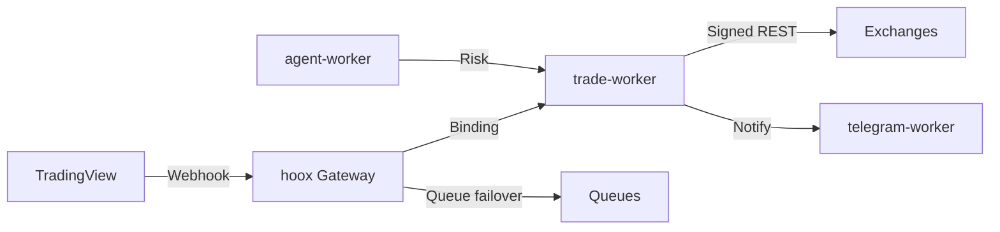

<!--
  Copyright (c) 2026 HOOX · jango-blockchained (hoox-sh)
  SPDX-License-Identifier: CC-BY-4.0
-->

# HOOX

**Ultra-low-latency edge trading framework, built on Cloudflare Workers.**

HOOX is a production-grade, open-source algorithmic trading stack. Signals are validated and executed inside V8 isolates colocated with exchange APIs, delivering a median signal-to-ack latency of **~22 ms** from **330+** global points of presence. No servers, no vendor lock-in.

<div align="center">


[](https://github.com/hoox-sh/hoox/actions/workflows/ci.yml)
[](https://codecov.io/gh/hoox-sh/hoox)
[](https://www.typescriptlang.org/)
[](https://bun.sh)
[](https://workers.cloudflare.com/)
[](https://www.npmjs.com/package/@hoox-sh/hoox-cli)
[](LICENSE-CODE)

**Site:** [hoox.sh](https://hoox.sh) · **Install:** [hoox.sh/install](https://hoox.sh/install) · **Docs:** [docs.hoox.sh](https://docs.hoox.sh) · **Paper:** [papers/hoox-arxiv-paper-core.pdf](papers/hoox-arxiv-paper-core.pdf)

**Stack:** ⚡ [**HOOX**](https://github.com/hoox-sh/hoox) _(this repo)_ · 🐍 [PYNE](https://github.com/hoox-sh/pyne) · 📊 [AXIS](https://github.com/hoox-sh/axis)

</div>

### Ecosystem

HOOX is the edge trading framework. Sister products on the same site:

| Product  | Role                                        | Repo                                            | Website                                                                  |
| -------- | ------------------------------------------- | ----------------------------------------------- | ------------------------------------------------------------------------ |
| **HOOX** | Edge trading framework (this repo)          | [hoox-sh/hoox](https://github.com/hoox-sh/hoox) | [hoox.sh](https://hoox.sh) · [docs](https://docs.hoox.sh)                |
| **PYNE** | Pine Script™ Python toolchain, LSP, Pro API | [hoox-sh/pyne](https://github.com/hoox-sh/pyne) | [hoox.sh/pyne](https://hoox.sh/pyne) · [docs](https://hoox.sh/pyne/docs) |
| **AXIS** | Installable charting PWA (Solid + Vite)     | [hoox-sh/axis](https://github.com/hoox-sh/axis) | [hoox.sh/axis](https://hoox.sh/axis) · [docs](https://hoox.sh/axis/docs) |

```
                    https://hoox.sh
           ┌──────────────┼──────────────┐
           ▼              ▼              ▼
         HOOX            PYNE           AXIS
    (edge execution)  (Pine engine)  (charting UI)
           │              │              │
           └──────────────┴──────────────┘
                    trade signals / eval API
```

---

## Install

The CLI is distributed as a Bun package. Bun is required — the CLI is a Bun bundle and will not run under Node.

```bash
# 1. Install Bun (if you don't have it)
curl -fsSL https://bun.sh/install | bash

# 2. Install the CLI globally
bun add -g @hoox-sh/hoox-cli

# 3. Clone the workspace (workers are git submodules — use --recursive)
git clone --recursive https://github.com/hoox-sh/hoox.git
cd hoox

# 4. Bootstrap: provisions D1, KV, secrets, and deploys in dependency order
hoox onboard

# 5. Later: CLI works from any directory (path is remembered after first use)
cd ~/Videos
hx doctor          # Source: remembered · Runtime root: …/hoox
```

`hoox onboard` is the recommended path. It writes `wrangler.jsonc`, collects secrets, generates keys, applies the D1 schema, pushes secrets, and deploys the dashboard. Alias: `hx`.

The CLI auto-detects the monorepo (`HOOX_REPO` → walk up from cwd → `~/.hoox/config/monorepo.json` → `~/.hoox/repo`), saves the path, and `chdir`s so you can run `hx` from any folder.

### Prerequisites

| Tool                   | Notes                                          |
| ---------------------- | ---------------------------------------------- |
| **Bun ≥ 1.2**          | Required. CLI is Bun-only.                     |
| **Cloudflare account** | Free tier is enough for typical retail volume. |
| **Git**                | For the workspace and submodules.              |
| **Docker + Compose**   | Optional — local mesh or self-host.            |

### Other install paths

**From source (full monorepo).** Canonical path for contributors and operators who need the full worker mesh.

```bash
git clone --recursive https://github.com/hoox-sh/hoox.git hoox-trading
cd hoox-trading
bun install
hoox onboard
hoox check health
```

If you cloned without submodules: `git submodule update --init --recursive` (or `hoox clone --all`).

**Local dev with Docker.** Mirrors the production Service Binding topology. Only the gateway (`hoox`) and `dashboard` expose host ports.

```bash
docker compose --profile workers up      # workers only
docker compose --profile dashboard up    # dashboard + deps
docker compose --profile full up         # full stack
# or: hoox dev start --runtime docker
```

| Service   | URL                   |
| --------- | --------------------- |
| Gateway   | http://localhost:8787 |
| Dashboard | http://localhost:8794 |

**Production / self-hosted.** For demos, local testing, or air-gapped runs. Not a full substitute for the Cloudflare edge — Durable Objects, Vectorize, and Workers AI are unavailable self-hosted.

```bash
bun run docker:prod
# or manually:
docker build -f Dockerfile.prod . --tag hoox:prod
docker run -p 8080:8080 -e HOOX_SERVER_API_KEY=your-key hoox:prod
```

The self-hosted gateway requires `HOOX_SERVER_API_KEY` for authenticated requests.

**Deploy to Cloudflare (production).** Onboard provisions infrastructure; deploy ships the workers.

```bash
hoox onboard
hoox deploy all --auto
hoox deploy telegram-webhook
hoox deploy update-internal-urls
hoox deploy kv-config
hoox check health
```

Non-interactive: `hoox onboard --token cfut_xxx --account xxx --preset full`.

Guides: [Installation](https://docs.hoox.sh/docs/enduser/getting-started/installation) · [Deploy](https://docs.hoox.sh/docs/devops/setup-and-operations)

---

## Quick path (edge)

```bash
# Bun only — `npm install -g @hoox-sh/hoox-cli` aborts (workspace:* optionalDependency).
# After `curl -fsSL https://bun.sh/install | bash`, put ~/.bun/bin on PATH.
bun add -g @hoox-sh/hoox-cli
git clone --recursive https://github.com/hoox-sh/hoox.git && cd hoox
hoox onboard
hoox deploy all --auto
hoox check health
```

| Package                 | Version | Published    |
| ----------------------- | ------- | ------------ |
| `@hoox-sh/hoox-cli`     | 0.13.1  | yes          |
| `@hoox-sh/hoox-tui`     | 0.3.2   | yes          |
| `@hoox-sh/hoox-shared`  | 1.4.0   | yes          |
| workspace root (`hoox`) | 0.13.1  | no (private) |

---

## Interfaces — CLI · TUI · Dashboard

The same stack, three surfaces. CLI for automation and CI, TUI for terminal operations, dashboard for visual monitoring and risk.

<p align="center">
  
</p>

| Surface       | Tour                                                                                                                                                           |
| ------------- | -------------------------------------------------------------------------------------------------------------------------------------------------------------- |
| **CLI**       | [help tour](docs/images/gifs/cli-help-tour.gif) · [deploy --help](docs/images/cli/help-deploy.png)                                                             |
| **TUI**       | [view switch](docs/images/gifs/tui-view-switch.gif) · [wizard](docs/images/tui/setup-wizard-step-02-api-keys.png) · [dashboard](docs/images/tui/dashboard.png) |
| **Dashboard** | [nav](docs/images/gifs/dashboard-nav.gif) · [setup](docs/images/dashboard/setup.png)                                                                           |

Full set (every view, command group, and page): [docs.hoox.sh → Interface gallery](https://docs.hoox.sh/docs/enduser/guides/screenshots) · files in [`docs/images/`](docs/images/).

### CLI

The primary operator interface. Running `hoox` with no arguments launches the interactive menu; `hoox tui` opens the full OpenTUI operations center.

| Command                         | Purpose                                        |
| ------------------------------- | ---------------------------------------------- |
| `hoox onboard`                  | Recommended bootstrap (init + setup)           |
| `hoox deploy all --auto`        | Workers + dashboard + wiring                   |
| `hoox dev start`                | Local native or Docker                         |
| `hoox check health`             | Post-deploy verification                       |
| `hoox monitor trades`           | Live trade stream                              |
| `hoox perf fastpath run --n 50` | Latency probes                                 |
| `hoox trace events`             | Workers observability                          |
| `hoox repair check`             | Diagnose and fix                               |
| `hoox doctor`                   | Paths, TUI entry, operator security hygiene    |
| `hoox tunnel check`             | Private ingress helpers (cloudflared + Access) |
| `hoox update`                   | Pull repo/submodule updates or update wrangler |
| `hoox completion`               | bash / zsh / fish                              |

Full reference: [CLI docs](https://docs.hoox.sh/docs/enduser/reference/cli-commands) · [packages/cli/README.md](packages/cli/README.md) · [hoox.sh/cli](https://hoox.sh/cli)

### TUI

```bash
hoox tui
# monorepo: bun run tui
# packages/tui: bun run dev | bun run build && bun run start
```

### Dashboard

```bash
hoox dev dashboard          # or: hoox dashboard dev  → localhost:3000
hoox deploy dashboard       # or: hoox dashboard deploy
docker compose --profile dashboard up   # localhost:8794
```

Production URL: `https://<your-subdomain>.workers.dev` (set during onboard). Requires the gateway, `d1-worker`, and `agent-worker` for full functionality. The dashboard runs on Cloudflare Workers via OpenNext, not Pages.

---

## Architecture

Eleven compute surfaces (ten Workers + the OpenNext dashboard) communicate over Cloudflare Service Bindings — direct isolate-to-isolate calls with sub-millisecond overhead, no public internet traversal, no TLS handshakes, no DNS resolution between components.

| Metric               | Value                       |
| -------------------- | --------------------------- |
| Median signal-to-ack | ~22 ms                      |
| Edge locations       | 330+                        |
| Isolates             | 11 (10 workers + dashboard) |
| Internal calls       | <1 ms (Service Bindings)    |

| Worker               | Role                                                                                                                                                                                        | Repository                                                          |
| -------------------- | ------------------------------------------------------------------------------------------------------------------------------------------------------------------------------------------- | ------------------------------------------------------------------- |
| `hoox` (gateway)     | Public webhook ingress, WAF/IP allowlist, rate limits, Durable Object idempotency, dispatch                                                                                                 | [hoox-worker](https://github.com/hoox-sh/hoox-worker)               |
| `trade-worker`       | Multi-exchange execution (Binance / Bybit / MEXC), queue consumers, D1 fills                                                                                                                | [trade-worker](https://github.com/hoox-sh/trade-worker)             |
| `agent-worker`       | AI risk manager — configurable cron (1–1440 min), trailing stops, kill switch                                                                                                               | [agent-worker](https://github.com/hoox-sh/agent-worker)             |
| `d1-worker`          | D1 SQL proxy (table allowlist), settings KV, balances & positions                                                                                                                           | [d1-worker](https://github.com/hoox-sh/d1-worker)                   |
| `telegram-worker`    | Notification plane — alerts, bot commands, RAG copilot                                                                                                                                      | [telegram-worker](https://github.com/hoox-sh/telegram-worker)       |
| `email-worker`       | Mailgun / email signal parsing → trade-worker                                                                                                                                               | [email-worker](https://github.com/hoox-sh/email-worker)             |
| `analytics-worker`   | Analytics Engine fan-in (trades, signals, latency, heartbeats)                                                                                                                              | [analytics-worker](https://github.com/hoox-sh/analytics-worker)     |
| `report-worker`      | Browser Rendering PDFs → R2, telegram delivery                                                                                                                                              | [report-worker](https://github.com/hoox-sh/report-worker)           |
| `web3-wallet-worker` | On-chain wallet identity (ethers.js / Secrets Store)                                                                                                                                        | [web3-wallet-worker](https://github.com/hoox-sh/web3-wallet-worker) |
| `pyne-worker`        | Python PYNE edge evaluate — Pine `/run`, bar-close cron, R2 OHLCV, alert webhooks; live strategy → trade-worker requires mesh internal key (`X-Internal-Auth-Key` / `INTERNAL_KEY_BINDING`) | [pyne-worker](https://github.com/hoox-sh/pyne-worker)               |
| `dashboard`          | Next.js ops console (OpenNext, public)                                                                                                                                                      | [workers/dashboard](workers/dashboard)                              |

Only the gateway and dashboard are public. Every other worker is a private isolate, reachable only via Cloudflare Service Bindings (except tooling auth such as pyne-worker `API_KEY`). Each worker is a **git submodule** with its own README and GitHub description; see [docs → Workers](https://docs.hoox.sh/docs/devops/workers) for operator isolate profiles.



---

## Docs & research

|              |                                                                                 |
| ------------ | ------------------------------------------------------------------------------- |
| Install UI   | [hoox.sh/install](https://hoox.sh/install)                                      |
| Product docs | [docs.hoox.sh](https://docs.hoox.sh)                                            |
| Quick start  | [5-minute guide](https://docs.hoox.sh/docs/enduser/getting-started/quick-start) |
| Paper        | [`papers/hoox-arxiv-paper-core.pdf`](papers/hoox-arxiv-paper-core.pdf)          |
| Brand        | [`brand/`](brand/)                                                              |
| Contributing | [`CONTRIBUTING.md`](CONTRIBUTING.md)                                            |

---

## Free forever. Open source.

HOOX is free to use, self-host, and modify — no paid core, no artificial limits on the open mesh. Deploy the full edge-native stack on Cloudflare's free tier for typical retail volume. Code is **Apache-2.0**; docs and papers are **CC BY 4.0**. Built for traders and operators who want production-grade infrastructure without a vendor lock-in tax.

---

## Security, cost & disclaimer

Zero-trust mesh: internal workers have no public HTTP. Secrets are injected into V8 isolates at runtime. Free-tier capable for typical retail volume. Operator management paths can sit behind Cloudflare Access / tunnel — verify with `hoox doctor --security` and `hoox tunnel check`.

**Disclaimer.** Educational and research use. Trading involves substantial risk of loss. Not financial advice. See [DISCLAIMER.md](DISCLAIMER.md) and [LICENSE](LICENSE).

Open core: **Apache-2.0** (code) · **CC BY 4.0** (docs/papers).

---

## The HOOX Stack — all products & sister projects

Everything under [github.com/hoox-sh](https://github.com/hoox-sh) — one open trading stack on [hoox.sh](https://hoox.sh):

```text
                    https://hoox.sh
           ┌──────────────┼──────────────┐
           ▼              ▼              ▼
         HOOX            PYNE           AXIS
    (edge execution)  (Pine engine)  (charting UI)
           │              │              │
           └──────────────┴──────────────┘
                    trade signals / eval API
```

**Main products**

| Product                | Role                                                                          | Repository                                      | Website                                                                  |
| ---------------------- | ----------------------------------------------------------------------------- | ----------------------------------------------- | ------------------------------------------------------------------------ |
| **HOOX** _(this repo)_ | Edge trading framework — signal validation & execution on Cloudflare® Workers | [hoox-sh/hoox](https://github.com/hoox-sh/hoox) | [hoox.sh](https://hoox.sh) · [docs](https://docs.hoox.sh)                |
| **PYNE**               | Pine Script™ toolchain — grammar, AST, dual-engine runtime, LSP, Pro API      | [hoox-sh/pyne](https://github.com/hoox-sh/pyne) | [hoox.sh/pyne](https://hoox.sh/pyne) · [docs](https://hoox.sh/pyne/docs) |
| **AXIS**               | Installable charting PWA — CEX OHLCV, drawings, on-chain overlays             | [hoox-sh/axis](https://github.com/hoox-sh/axis) | [hoox.sh/axis](https://hoox.sh/axis) · [docs](https://hoox.sh/axis/docs) |

**PYNE satellites**

| Project               | Role                                                                     | Repository                                                                                                                                                       |
| --------------------- | ------------------------------------------------------------------------ | ---------------------------------------------------------------------------------------------------------------------------------------------------------------- |
| **PyneTS**            | TypeScript / Bun library (`@hoox-sh/pynets`) — parse, unparse, interpret | [hoox-sh/pynets](https://github.com/hoox-sh/pynets)                                                                                                              |
| **pyne-worker**       | Python Cloudflare® Worker — edge `POST /run`, cron, R2, alerts           | [hoox-sh/pyne-worker](https://github.com/hoox-sh/pyne-worker)                                                                                                    |
| **pyne-agent-worker** | Workers AI Pine agent — RAG + validate loop                              | [hoox-sh/pyne-agent-worker](https://github.com/hoox-sh/pyne-agent-worker)                                                                                        |
| **pyne-lsp**          | Language server `pyne-lsp` (in the PYNE tree)                            | [hoox-sh/pyne](https://github.com/hoox-sh/pyne) · [docs](https://hoox.sh/pyne/docs/lsp)                                                                          |
| **pyne-vscode**       | VS Code / Open VSX extension (in the PYNE tree)                          | [vscode-extension](https://github.com/hoox-sh/pyne/tree/main/vscode-extension) · [Marketplace](https://marketplace.visualstudio.com/items?itemName=hoox-sh.pyne) |

**AXIS satellites**

| Project                     | Role                                                               | Repository                                                                            |
| --------------------------- | ------------------------------------------------------------------ | ------------------------------------------------------------------------------------- |
| **axis-plugin-boilerplate** | Starter for source / stream / engine / dataset / component plugins | [hoox-sh/axis-plugin-boilerplate](https://github.com/hoox-sh/axis-plugin-boilerplate) |

**HOOX execution & ops plane**

| Worker                 | Role                                                     | Repository                                                                  |
| ---------------------- | -------------------------------------------------------- | --------------------------------------------------------------------------- |
| **hoox-worker**        | Public gateway — webhooks, WAF, DO idempotency, dispatch | [hoox-sh/hoox-worker](https://github.com/hoox-sh/hoox-worker)               |
| **trade-worker**       | Multi-exchange execution — Binance, Bybit, MEXC          | [hoox-sh/trade-worker](https://github.com/hoox-sh/trade-worker)             |
| **agent-worker**       | AI risk manager — cron, trailing stops, kill switch      | [hoox-sh/agent-worker](https://github.com/hoox-sh/agent-worker)             |
| **d1-worker**          | D1 SQL proxy — balances, positions, settings             | [hoox-sh/d1-worker](https://github.com/hoox-sh/d1-worker)                   |
| **telegram-worker**    | Telegram alerts + RAG copilot                            | [hoox-sh/telegram-worker](https://github.com/hoox-sh/telegram-worker)       |
| **web3-wallet-worker** | On-chain wallet identity (ethers.js)                     | [hoox-sh/web3-wallet-worker](https://github.com/hoox-sh/web3-wallet-worker) |
| **email-worker**       | Mailgun ingress — natural language → trade signals       | [hoox-sh/email-worker](https://github.com/hoox-sh/email-worker)             |
| **analytics-worker**   | Analytics Engine fan-in — trades, signals, latency       | [hoox-sh/analytics-worker](https://github.com/hoox-sh/analytics-worker)     |
| **report-worker**      | Browser Rendering PDFs → R2, cron delivery               | [hoox-sh/report-worker](https://github.com/hoox-sh/report-worker)           |
| **dashboard**          | Next.js ops console (in the HOOX tree)                   | [hoox-sh/hoox](https://github.com/hoox-sh/hoox)                             |
| **pine-worker**        | Pine evaluator → trade events (private)                  | [hoox-sh/pine-worker](https://github.com/hoox-sh/pine-worker)               |

**Web**

| Project               | Role                                                 | Repository                                                                |
| --------------------- | ---------------------------------------------------- | ------------------------------------------------------------------------- |
| **hoox-landing-page** | Marketing site source for [hoox.sh](https://hoox.sh) | [hoox-sh/hoox-landing-page](https://github.com/hoox-sh/hoox-landing-page) |

## Ethos

- **Independent & open** — no proprietary chart host, no closed data services; evaluation never depends on TradingView®.
- **Edge-first** — compute colocated with exchanges on Cloudflare's global network.
- **Local-first** — AXIS runs fully offline (Pyodide); PYNE runs on your machine; HOOX self-hosts on the free tier.
- **No vendor lock-in** — open core, self-hostable, exportable.
- **Batteries included** — CLIs, LSP, dashboards, docs, and one-click deploy buttons ship in the box.

> **Disclaimer.** _Pine Script™_ and _TradingView®_ are trademarks of [TradingView, Inc.](https://www.tradingview.com/); _Cloudflare®_ is a trademark of Cloudflare, Inc. The HOOX stack is **independent** and is not affiliated with, authorized by, sponsored by, or endorsed by either company. Educational and research use; trading involves substantial risk of loss — this is not financial advice.

⚡ **Powered by Cloudflare** — Workers · D1 · R2 · KV · Queues · Analytics Engine · Workers AI · Browser Rendering

## License

Open core: **Apache-2.0** (code — see [LICENSE-CODE](LICENSE-CODE)) · **CC BY 4.0** (docs & papers). Copyright © 2026 HOOX · jango-blockchained (hoox-sh).

🔋 Batteries included.
