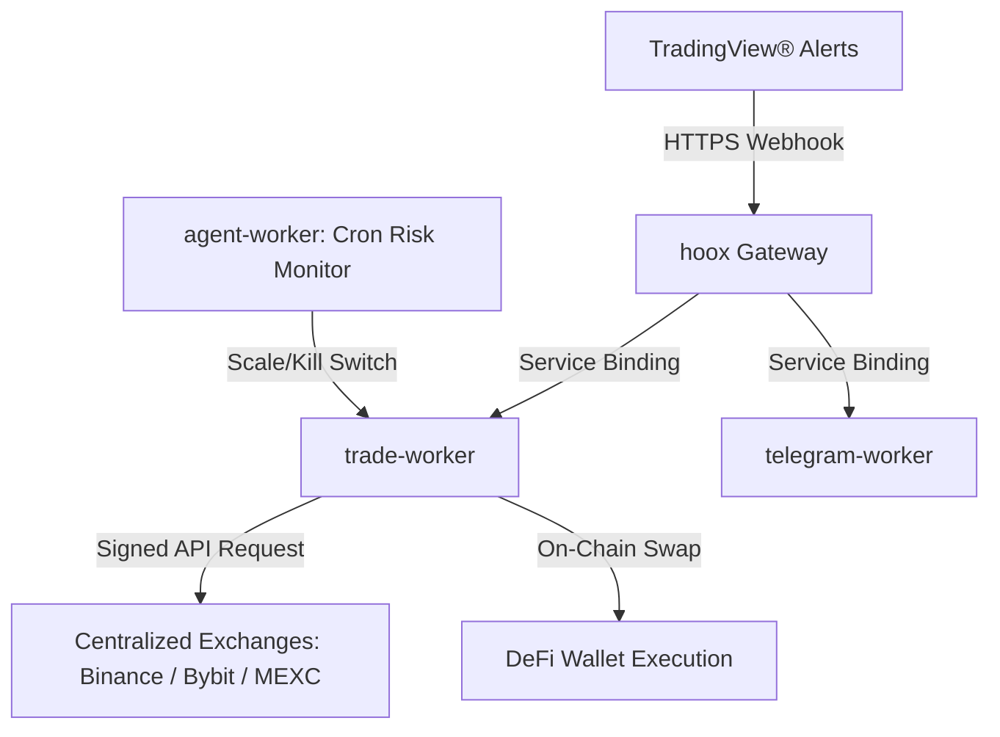

<!--
  Copyright (c) 2026 HOOX · jango-blockchained (hoox-sh)
  SPDX-License-Identifier: CC-BY-4.0
-->

---
title: "Hoox Documentation"
description: "Edge-Native Algorithmic Trading on the Cloudflare® Edge"
---

Hoox is a free, open-source, edge-native algorithmic trading framework and automation engine deployed natively to the Cloudflare® Edge Network. By utilizing a distributed microservice architecture, Hoox processes trade signals, evaluates risk parameters, executes order routing, and fires Telegram notifications—all within milliseconds and directly from the edge nodes closest to exchange servers.

Install: `bun add -g @hoox-sh/hoox-cli` → `hoox onboard` (alias `hx`).

<Tip>
  Docs are split into **main tabs** (same pattern as AXIS / PYNE): trader-facing
  **End User**, platform **Architecture** and **Workers**, operators **DevOps**,
  contracts **API**, and commercial **Enterprise**.
</Tip>

## Documentation categories

<CardGroup cols={3}>
  <Card title="End User" icon="user" href="/docs/enduser">
    Getting started, concepts, guides, tutorials, CLI and FAQ for traders and
    operators of a live mesh.
  </Card>
  <Card title="Ecosystem" icon="mesh" href="/docs/enduser/concepts/ecosystem">
    HOOX vs PYNE vs AXIS vs PyneTS vs pyne-worker — what each surface does.
  </Card>
  <Card title="PYNE live trading" icon="signal" href="/docs/enduser/guides/pyne-live-trading">
    Strategy events from pyne-worker to trade-worker. Alerts are a separate path.
  </Card>
  <Card title="AXIS and HOOX" icon="chart" href="/docs/enduser/guides/axis-and-hoox">
    The PWA evaluates. The mesh executes. They do not share an order router.
  </Card>
  <Card title="Architecture" icon="layers" href="/docs/devops/architecture">
    Mesh topology, data flow, bindings, storage, and ADRs.
  </Card>
  <Card title="Workers" icon="worker" href="/docs/devops/workers">
    Per-isolate profiles — gateway, trade, D1, agent, telegram, dashboard, and
    more.
  </Card>
  <Card title="DevOps" icon="terminal" href="/docs/devops">
    Install, local development, deployment, CI/CD, security, CLI and TUI.
  </Card>
  <Card title="API" icon="book" href="/docs/devops/api">
    HTTP endpoints, request payloads (including `test: true`), and response
    envelopes.
  </Card>
  <Card title="Enterprise" icon="lock" href="/docs/enterprise">
    Multi-tenancy, compliance, and institutional architecture notes (commercial
    layer).
  </Card>
</CardGroup>

## Popular paths

| Goal | Start here |
| ---- | ---------- |
| Install CLI + first deploy | [Installation](/docs/enduser/getting-started/installation) · [Quick Start](/docs/enduser/getting-started/quick-start) |
| Sandbox / testnet orders | [Test Trading](/docs/enduser/guides/test-trading) |
| How a signal becomes a fill | [How Hoox Works](/docs/enduser/concepts/how-hoox-works) |
| Pine strategy → live order | [PYNE live trading](/docs/enduser/guides/pyne-live-trading) |
| Chart without trading | [AXIS and HOOX](/docs/enduser/guides/axis-and-hoox) |
| Exchange execution isolate | [trade-worker](/docs/devops/workers/trade-worker) |
| Production rollout | [Production Deployment](/docs/devops/deployment/production) |
